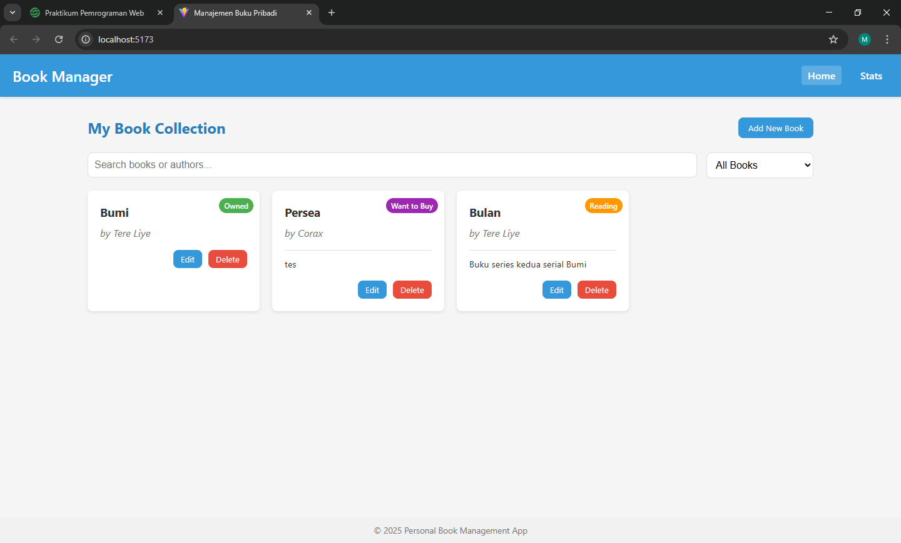
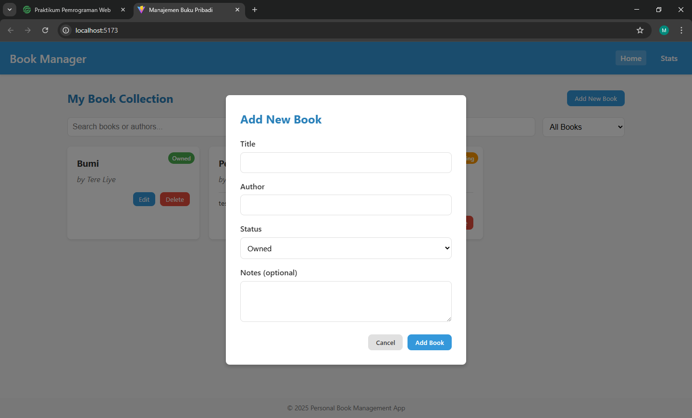
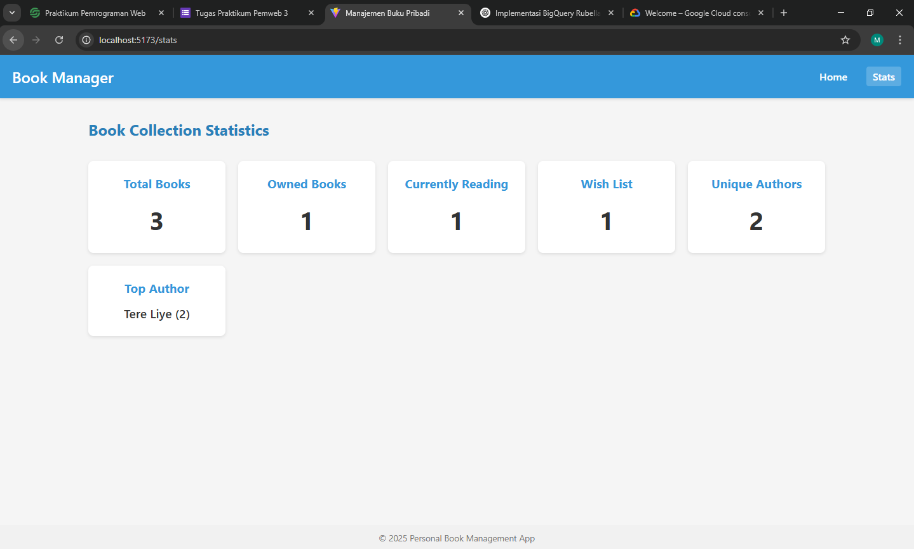
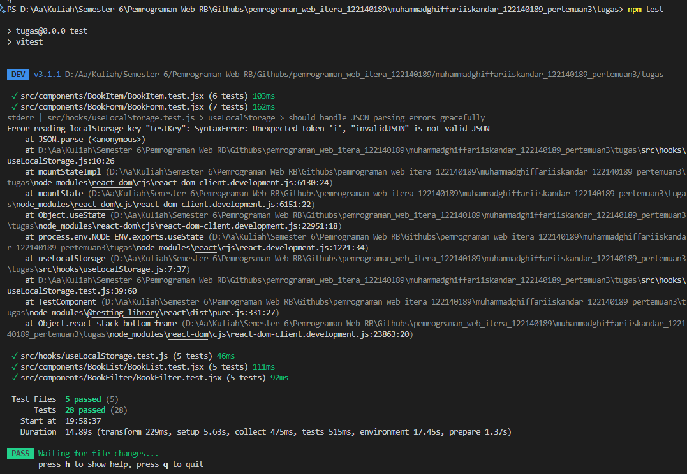

# Aplikasi Manajemen Buku Pribadi

Aplikasi React untuk mengelola koleksi buku pribadi Anda, memungkinkan untuk melacak buku yang Anda miliki, sedang dibaca, atau ingin dibeli.

## Fitur

- Tambah buku baru dengan judul, penulis, status, dan catatan opsional
- Edit dan hapus buku yang ada
- Filter buku berdasarkan status (dimiliki, sedang dibaca, ingin beli)
- Cari koleksi berdasarkan judul atau penulis
- Lihat statistik koleksi buku Anda
- Data tersimpan di browser menggunakan localStorage

## Tangkapan Layar


*Halaman utama menampilkan koleksi buku*


*Menambahkan buku baru ke koleksi*


*Statistik tentang koleksi buku Anda*

## Instalasi dan Pengaturan

1. Klon repositori
```
git clone https://github.com/GhiffariIs/pemrograman_web_itera_122140189.git
cd book-management-app
```

2. Instal dependensi
```
npm install
```

3. Jalankan server pengembangan
```
npm run dev
```

4. Buka browser dan akses `http://localhost:5173`

## Teknologi yang Digunakan

- **React** - Pustaka UI
- **React Router** - Untuk navigasi antar halaman
- **Vite** - Alat build dan server pengembangan
- **LocalStorage API** - Untuk penyimpanan data sisi klien

## Fitur React yang Digunakan

### Manajemen State
- **useState** - Untuk manajemen state tingkat komponen
- **useReducer** - Untuk operasi state yang lebih kompleks
- **Context API** - Untuk manajemen state global antar komponen

### Efek dan Siklus Hidup
- **useEffect** - Untuk efek samping seperti sinkronisasi localStorage

### Hook Kustom
- **useLocalStorage** - Hook kustom untuk persistensi localStorage
- **useBookStats** - Hook kustom untuk menghitung statistik buku

### Routing
- **React Router** - Untuk navigasi antara halaman Utama dan Statistik

### Arsitektur Komponen
- Komponen yang dapat digunakan kembali untuk item buku, form, dan daftar
- Komposisi komponen yang tepat dan menghindari props drilling

### PropTypes
- Pengecekan tipe untuk semua props komponen

### Pengujian
- Uji unit dengan React Testing Library

## Struktur Proyek

```
src/
├── components/
│   ├── BookForm/
│   ├── BookList/
│   └── Navbar/
├── pages/
│   ├── Home/
│   └── Stats/
├── hooks/
│   ├── useLocalStorage.js
│   └── useBookStats.js
├── context/
│   └── BookContext.js
└── App.js
```

## Pengujian

Jalankan rangkaian pengujian dengan:

```
npm test
```

### Laporan Hasil Pengujian

Berikut adalah hasil dari pengujian unit menggunakan Vitest dan React Testing Library:

#### Contoh Hasil Pengujian
- **Komponen BookForm**:
  - Validasi input berhasil dilakukan.
  - Fungsi `addBook` dan `editBook` dipanggil dengan data yang benar.
  - Tombol "Batal" berhasil menutup form.

- **Komponen BookList**:
  - Filter berdasarkan status dan pencarian bekerja dengan benar.
  - Pesan "Tidak ada buku ditemukan" muncul saat tidak ada buku yang sesuai dengan filter.

#### Tangkapan Layar Hasil Pengujian
